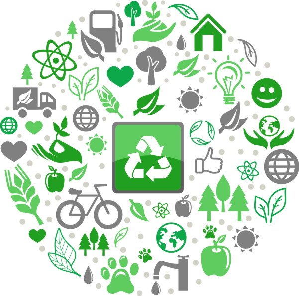

# Recycling Web Tool

## Table of Contents

- [Introduction](#introduction)
- [Technologies Used](#technologies-used)
- [Features](#features)
- [Getting Started](#getting-started)
- [Usage](#usage)
- [Database](#database)
- [Contributing](#contributing)

## Introduction

Welcome to the Recycling Web Tool! This web application is designed to help users properly dispose of their trash by providing information on different items and their correct disposal methods. The tool uses Flask, SQLite, and Peewee ORM to manage and display the recycling data effectively.

## Technologies Used

- Flask: A Python web framework used for building the backend.
- SQLite: A lightweight, serverless database used for storing recycling information.
- Peewee ORM: A simple and expressive Object-Relational Mapping library for Python.
- [dotenv, javascript, hashlib, json]

## Features

1. **Item List:** The web tool displays a list of different items that users can search through.

2. **Item Details:** When a user clicks on an item from the list, they can view additional steps that need to be taken before disposing of it and the correct bin for recycling.

## Getting Started

To get a local copy of this project up and running on your machine, follow these steps:

1. Clone this repository: `git clone https://github.com/SamLinoFinnegan/Recycling_App.git`
2. Navigate to the project directory: `cd project directory`
3. Install dependencies: `pip install -r requirements.txt`
4. First run `python db.py` to create a test database
5. Start the Flask development server: `python main.py`
6. Open your web browser and visit: `http://localhost:5000`

## Usage

1. Upon opening the website, you will see a list of different items that users can search through.
2. Click on an item to view additional information, such as any pre-disposal steps and the correct recycling bin.

## Database

The recycling web tool uses SQLite as its database to store information about different items and their recycling details. The database schema is designed using Peewee ORM.

The `Products.db` SQLite database file contains the following tables:

The Product table:

1. `name`: Contains the product name.
2. `trigger`: Contains a trigger that will let the user know if there are any steps to take before disposing of the item.
3. `pack`: Type of material the item contains.
4. `bin`: Stores the correct bin for recycling each item.
   
The User table:

1. `name`:The username (admin)
2. `password`: The user password (admin)

Please refer to the `models.py` file for the database schema and the `db.py` file for pre-populated data.

## Contributing

I appreciate any contributions to enhance this Recycling Web Tool. If you encounter any issues or have suggestions for improvements, feel free to open an issue or submit a pull request. Let's work together to make this web tool even more helpful!

